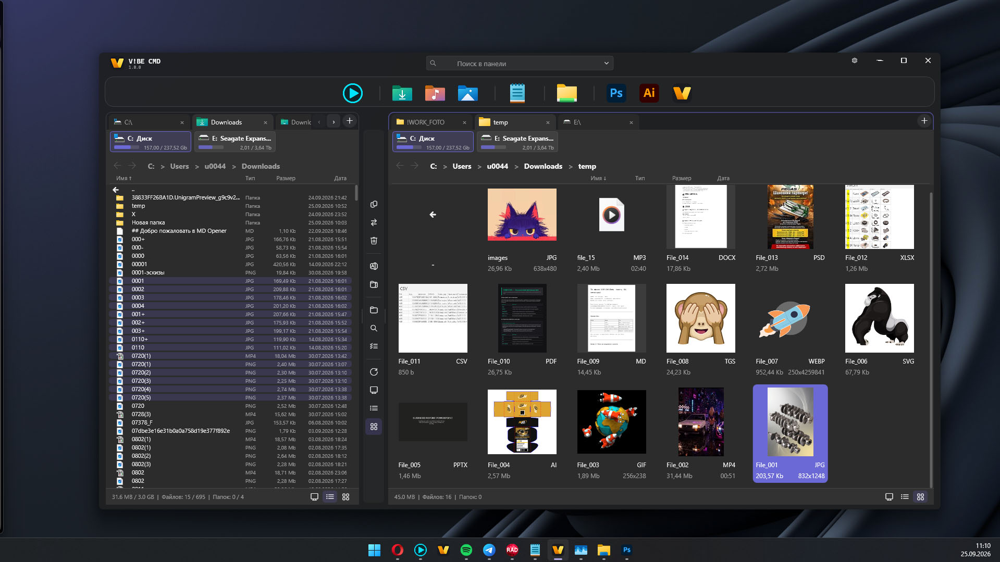
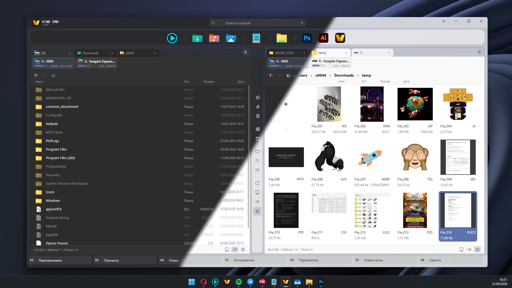
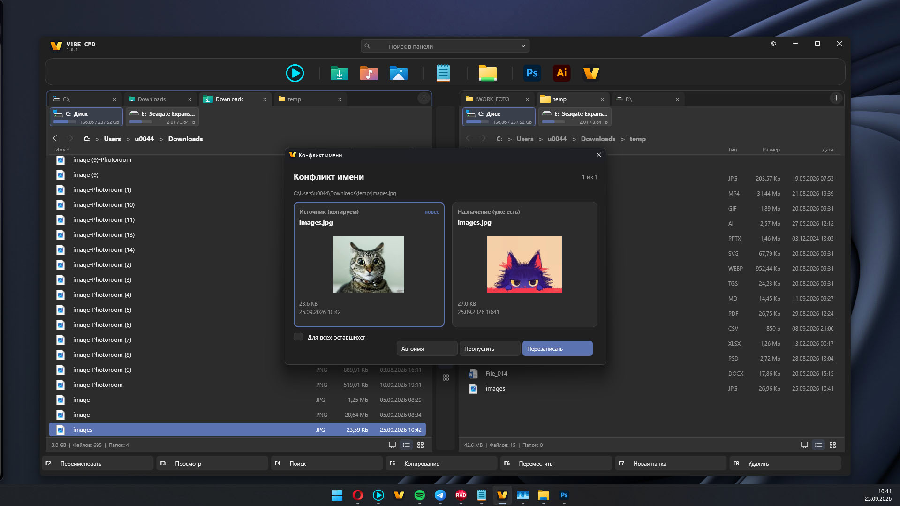
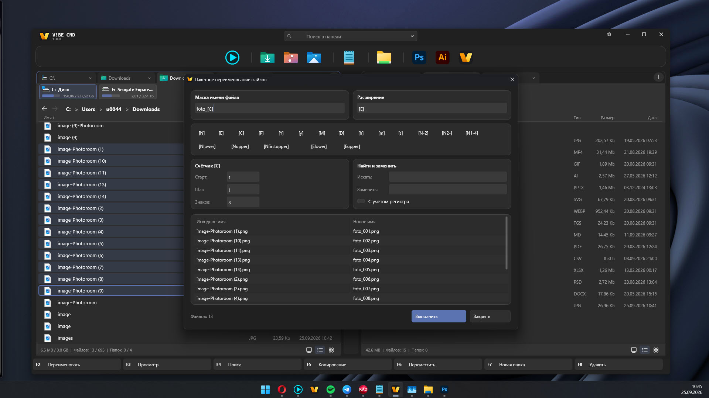
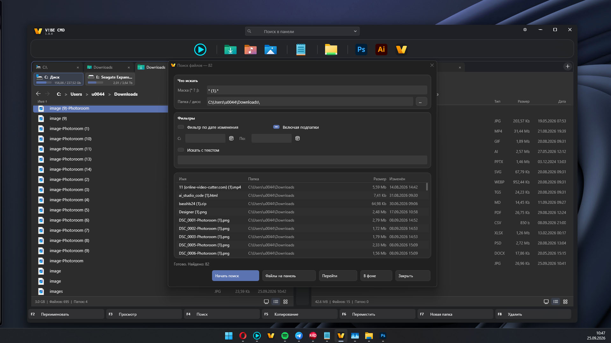
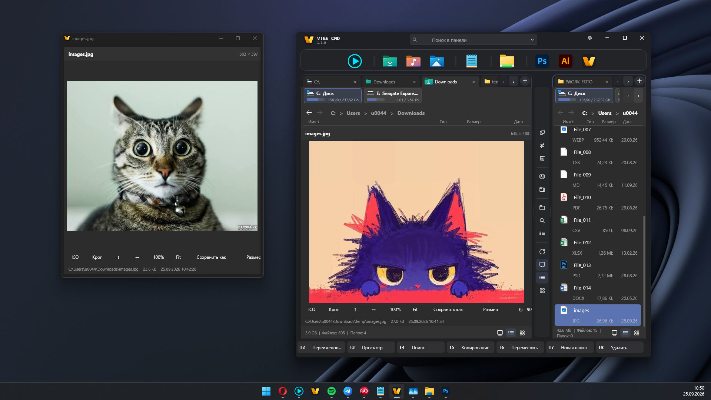
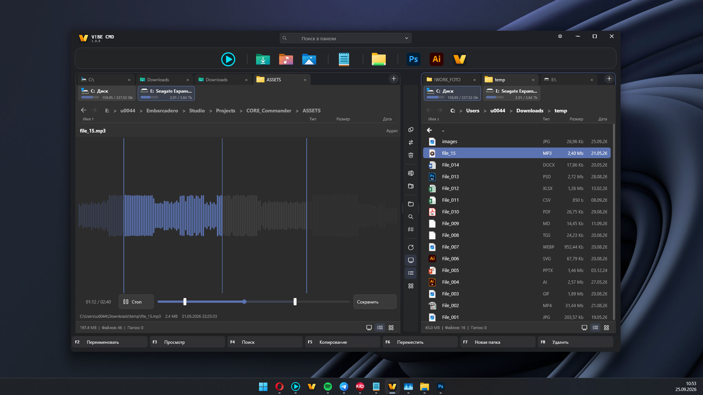
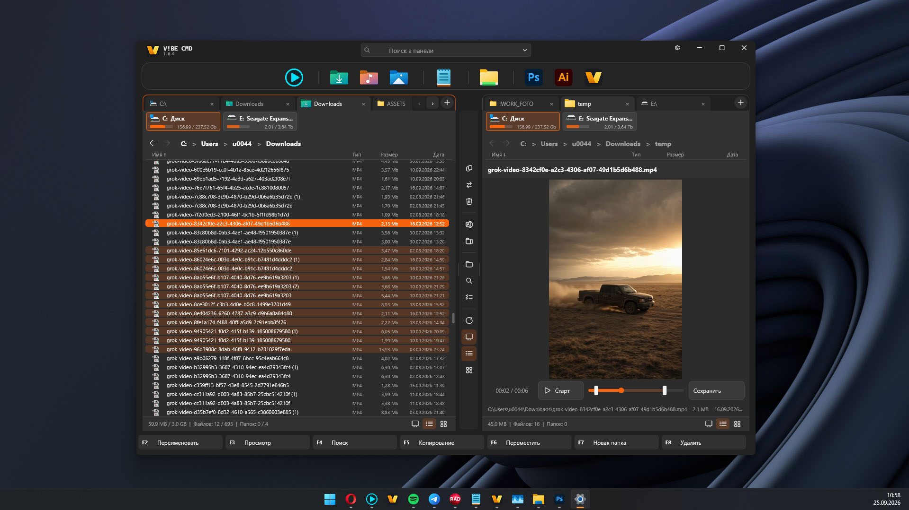

# V!BE CMD

A dual-pane file manager for Windows. Fluent chrome, Total Commander–style selection, and a Quick View that shows the file — not just an icon.



Windows · Delphi / FireMonkey · a daily driver, not a skin on top of `TListView`.

Also: [Українською](README.uk.md) · [По-русски](README.ru.md)

---

## Contents

- [Why](#why)
- [Screenshots](#screenshots)
- [Interface](#interface)
- [Features](#features)
- [Quick View](#quick-view)
- [Keyboard](#keyboard)
- [File operations](#file-operations)
- [Settings](#settings)
- [Stack](#stack)
- [Build](#build)
- [Dependencies next to the exe](#dependencies-next-to-the-exe)
- [On-disk settings](#on-disk-settings)
- [Status](#status)
- [License](#license)

---

## Why

Total Commander is still the fastest way to move files. Explorer is the shell everyone else lives in. V!BE CMD sits between them: two panes, keyboard first, a modern frame, previews that do not freeze the UI.

Panes paint themselves (`TPaintBox` + a virtual list). Icons and metadata are not read on the paint path.

---

## Screenshots









---

## Interface

### Window chrome

- Custom Fluent title bar: icon, caption, quick search in the center, settings, minimize / maximize / close.
- Theme: follow system / light / dark. Windows accent color is picked up.
- Window material: normal / Acrylic / Mica (Windows 11).
- Rounded corners via DWM.

### Layout

Top to bottom:

1. **Title bar** — live filter for the active pane (`Ctrl+F` / `Ctrl+E`), query history.
2. **Dock** — large pin strip (folders, files, apps). Accepts drag-and-drop, mouse reorder, separators, custom captions and images. A dead path (USB / network gone) is a grey icon you can remove by hand. Left-click a folder pin to open it in the active pane.
3. **Drive bar** — volumes and free space; remembers the last path per volume.
4. **Two panes** with Chrome / Explorer-style tabs (`+`, close, drag-reorder).
5. **Mid command column** — copy, move, delete, archive, new folder, QV.
6. **Status bar** — item under the cursor, selection size, disk.

Each pane is independent: path, view, zoom, sort, and cursor are stored per tab and written to the ini.

### File pane

Two views on one control:

| View | Behavior |
| --- | --- |
| **Details** | Icon + name without extension on the left; type / size / date on the right. As the pane shrinks, the date compresses (`dd.mm.yyyy hh:mm` → `dd.mm.yy hh:mm` → `dd.mm.yy`), then metadata wraps to a second line and headers center like tiles. The name column is elastic. |
| **Tiles** | Thumbnail (`GetFileThumbnail` / cache) + caption. Image tiles show size (`1200×1600`); media tiles show duration. |

Shared:

- `..` is always the first row when a parent exists.
- Hidden / system items use a dimmed icon (if enabled in settings).
- Live zoom, separate for details and tiles.
- Breadcrumbs + in-place path edit.
- History back / forward (`Alt+←` / `Alt+→`, mouse buttons).
- Title-bar filter applies to the active pane immediately.
- Owner-draw + a pool of visible rows: dozens of items on screen, not ten thousand controls.
- UNC shares (`\\host\share\…`) load in the background in chunks. On a drop-out the list is not reset to zero; the `..` row shows “connecting / server not responding” and a skip action.
- Archives open as folders (ZIP / TAR / GZ / 7z / RAR when 7-Zip is present).

---

## Features

### Selection (Total Commander rules)

Cursor and multi-select are separate. Focus does not jump after `Insert`.

- `Insert` / `Space` — toggle and step
- `Shift` — range, `Ctrl` — pick
- `+` / `-` — mask (`*.pas;*.inc`)
- `Alt++` / `Alt+-` — same type as the cursor
- `*` — invert
- `Ctrl+A` / `Ctrl+-` — all / none
- Compare pane directories

### Dock

- Pins: folder, file, app, separator
- Drop onto a dock folder → copy into it
- Drop onto an exe → open with that app
- Custom icons: prefer exe / `.ico` / folder `desktop.ini`, no frame, large. Context menu “Change picture” (raster; SVG if Skia is present)
- Tooltip with caption and full path
- Align: left / center / free
- State is written to ini without blocking the UI

### Search (`F4` / `Alt+F7`)

A Fluent window in the same style as Settings, not a stock `TEdit`.

- Mask `*` `?` `;`
- Recurse, last-write date range
- Text inside the file (UTF-8 / ANSI)
- Owner-drawn result list
- “Go” — active pane jumps to the hit
- “Files to pane” — virtual list of hits
- “Background” — window hides, search keeps running

### Rename

- `F2` / `F9` — inline single name
- Several selected → batch window: masks `[N]`, `[C]`, dates, find/replace, collisions visible before apply

### Clipboard and drag-and-drop

- `Ctrl+C` / `X` / `V` — files like Explorer
- `Ctrl+V` over a pane with an image / PrintScreen in the clipboard — create an image file in the current folder and a tile preview
- Drag between panes, to Explorer, from a browser (URL / image fetched in the background)
- Outgoing drag via `SHDoDragDrop`

### Archives

Virtual file system inside the archive. Write: ZIP, TAR, GZ, TGZ, 7z. RAR — read if 7-Zip is present. `Alt+F5` packs the selection into an archive on the other pane.

### Recycle Bin

Delete goes through Shell `FOF_ALLOWUNDO` when the mode allows it. `Shift+Del` / “permanent” setting — no Recycle Bin.

---

## Quick View

Two places: an in-window column (`Ctrl+Q`) and a floating window (`F3`). Switching the file in the pane drops unsaved image edits with a toast, not a modal.

| Family | What you see |
| --- | --- |
| Raster | JPEG / PNG / BMP / GIF / TIFF / WebP / TGA / ICO / CUR / HEIC / AVIF / JXL (if WIC/Skia is there) |
| Vector | SVG / SVGZ — Skia, vector zoom |
| PDF / AI | PDFium, pages, zoom |
| PSD / PSB | embedded preview resource |
| Spreadsheets | own grid for xlsx / xlsm / xlsb / xls / csv / tsv — memory caps, no crash on broken workbooks |
| Documents | DOCX / ODT / RTF / Markdown as page sheets |
| Text and code | two modes: A4 sheets and monospace code (Cascadia / Consolas), highlight for JSON / XML / MD / Pas / JS, select and copy |
| HTML | WebView2 (Edge), page as in a browser; source is the text mode |
| Fonts | glyph map |
| Archives | listing |
| Media | MFPlay (video in a child HWND, aspect preserved). Audio with no window. Clip export: lossless WAV / Media Foundation / `ffmpeg.exe` next to the app |
| Hex | dump if the type is unknown |
| Folder | directory card: icon, path, size, counts |

Tiles use the same pipelines through `uThumbCache` (RAM LRU + size/date stamp). A text tile is a mini A4 sheet, same as DOCX.

### Mini image editor (in QV)

Edits go into the `FImgWork` buffer. The file on disk is untouched until Save.

- Rotate 90° L/R, flip H/V
- Resize with aspect lock
- Rectangle crop (Enter / Esc)
- Save As: PNG / JPEG / BMP / WEBP, SVG→PDF, ICO build 16/32/48/256
- ICO/CUR frame strip
- If the signature does not match the extension — a “rename” banner

---

## Keyboard

| Key | Action |
| --- | --- |
| `Tab` | Other pane |
| `Enter` / `Backspace` | Open / up |
| `F2` / `F9` | Rename (batch if many selected) |
| `F3` | Quick View window |
| `F4` / `Alt+F7` | File search |
| `F5` / `F6` | Copy / move |
| `Alt+F5` | Pack to archive |
| `F7` | New folder |
| `F8` / `Del` | Delete (`Shift` — permanent) |
| `Ctrl+Q` | In-pane QV |
| `Ctrl+F` / `Ctrl+E` | Quick filter on the title bar |
| `Ctrl+A` / `Ctrl+-` | Select all / none |
| `+` / `-` | Mask select / unselect |
| `Alt++` / `Alt+-` | Same type |
| `*` | Invert |
| `Insert` / `Space` | Toggle + step |
| `Alt+←` / `Alt+→` | Pane history |
| `Ctrl+Shift+F1` | Details ↔ tiles |
| `Ctrl+C` `X` `V` | Clipboard |
| `Esc` | Close dialog / cancel operation |

In the V!be conflict window: `R` replace, `S` skip, `A` auto-name, `N` newer, `Esc` cancel.

---

## File operations

Three modes in settings:

| Mode | Behavior |
| --- | --- |
| **V!be** (default) | Own engine + floating progress: pause, skip, background, queue. Name conflict on the same window: two previews, “newer”, “apply to all”. |
| **Quiet** | No progress and no Shell dialogs. Conflict batch uses `uConflictDialog` with previews. Clean files go first; collisions are a second pass. |
| **Explorer** | `SHFileOperation` with native Windows dialogs. |

Copying a list:

1. Ordinary files go immediately.
2. A name clash is queued — it does not stop the batch.
3. After success, selection is cleared on the source.
4. Drag-copy shows a loader on the copy button and clears selection as files finish.

A file cannot overwrite itself. Office `~$lock` files are not treated as useful objects.

---

## Settings

Card-based window, no VCL edits.

- Theme and window material
- Show dock / drives / mid-bar / status / Fn
- Hidden and system files
- List font (Segoe UI, 10–22)
- Icons on tabs, equal tab width
- Thumb cache: on/off, limit 50–4000
- File-operation mode
- Window geometry and splitter position

File: `VibeSetting.ini` next to the exe. Legacy `TCClone.ini` is read as one tab per pane.

---

## Stack

```
uMain                 window, mid-bar, keys, title search
uFilePanel            owner-draw pane + tabs + two-line details
uCustomTabs           Chrome / Explorer tabs
uFileModel            listing thread, shell / zip / UNC / MTP
FileSelectionManager  cursor ≠ selection
uLaunchDock           dock
uFilePreview          QV router
uQuickViewForm        floating F3 window
uThumbCache           async thumbs
uIconCache            icons by extension (paint hot path)
uMetaCache            WxH and duration for tiles
uSpreadsheet*         xlsx / csv grid
uDocument*            docx / odt / pages
uTextCode / uCodeView text and code
uPdfium               pdf / ai
uPsdPreview           psd / psb
uMpvPlayer            MFPlay + MCI wav
uArchiveEngine        virtual archive FS
uFileOps + Engine     three operation modes
uConflictDialog       quiet conflicts
uFileOpProgressForm   V!be progress
uSearchForm           Alt+F7
uFluent*              edit, combo, date, chrome, scrollbar
uThemeManager         light / dark / accent
uAppSettings          ini
uDirWatcher           FindFirstChangeNotification
uWinShellMenu         shell context menu
uWinFileDrag          outgoing drag
uWinBrowserDrop       drop from a browser
uClipboardImage       PrintScreen → file
uImageSniff           signature vs extension
```

Delphi 12 / 13 · FMX Win32 or Win64. Shell and `IFileOperation` stay on Win32. There is no `SHGetFileInfo` on the paint path.

---

## Build

1. RAD Studio 12 or 13, target **Windows 32/64 — FireMonkey**.
2. Open the `.dpr` / project group.
3. Skia4Delphi — if the project has `GlobalUseSkia` (SVG, part of preview).
4. Build Release. The debugger lies about speed on large network folders — measure with Run without debugging.

---

## Dependencies next to the exe

None of these are required to start the panes.

| File | Why |
| --- | --- |
| `pdfium.dll` | PDF / AI in QV and on tiles |
| Skia runtime | SVG, some raster, webp/gif/lottie animation |
| `ffmpeg.exe` | media clip in the source container (gyan.dev essentials) |
| `7z.exe` / `7za.exe` | 7z / rar listing and packing |

Without them those formats fall back to an icon + info. The app does not crash.

WebView2 Runtime is needed for an HTML *page* in QV. If the engine is missing, source view is used.

---

## On-disk settings

```
VibeSetting.ini     theme, panes, tabs, dock, search history
```

The thumb cache lives in process memory (LRU). Spreadsheet dumps are not written to disk: a sheet thumb is recomputed; the full grid exists only in QV.

---

## Status

A working daily tool. Panes, dock, QV, search, and operations are in regular use.

Known edges:

- Very large UNC folders (thousands of photos) — background + incremental fill, not an instant full listing like a local SSD.
- Some system folder thumbnails come from the Shell with a black/white background — that is Windows, not only V!BE.
- The old IE fallback for HTML is not the target; Edge WebView2 is.

---

## Name

**V!BE CMD** — a commander with a pulse. Keep the bang in the logo.

---

## License

MIT. See [LICENSE](LICENSE).

Segoe Fluent Icons are part of Windows. PDFium / Skia / ffmpeg / 7-Zip keep their own licenses and are not part of the source tree.

---

## Contributing

The repo is personal for now. If you open an issue, include:

- Windows version and Delphi
- local disk or UNC
- pane mode (details / tiles) and operation mode (V!be / quiet / Explorer)
- a file that crashes QV, if you can share it

Do not send passwords, tokens, or other people’s documents with personal data.

---

<p align="center">
  <sub>Kharkiv · built for people who live in two panes</sub>
</p>
